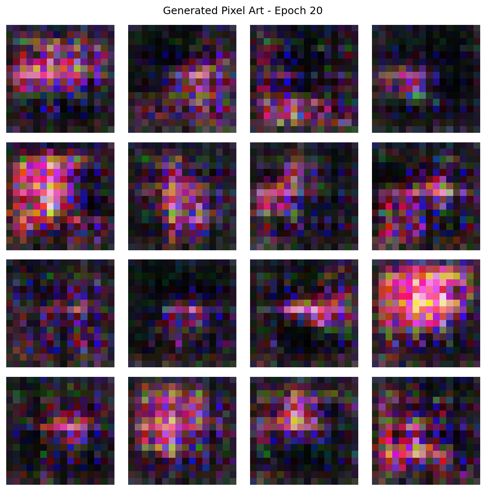
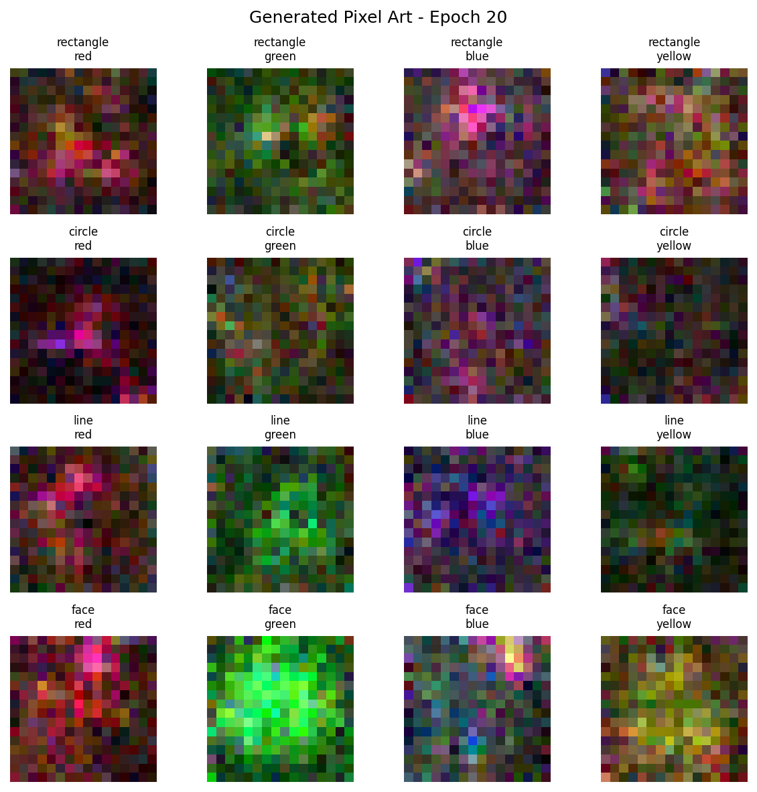

# Pixel Art Generation with GANs and Diffusion Models
This repository contains Python scripts for generating 16x16 pixel art sprites using Generative Adversarial Networks (GANs) and Denoising Diffusion Probabilistic Models (DDPMs)(Diffusion Models). The project includes implementations for both unconditional and conditional diffusion models, allowing for the generation of specific types of sprites.
## Overview
This project explores and implements different deep learning techniques for generative art. The goal is to generate small, 16x16 pixel art sprites. The included scripts (sprites.py) provide the necessary components to create a dataset of simple geometric shapes and faces, and then train generative models to produce similar sprites.
## Models Implemented
### GAN
- File: ```train_gan.py```
- Description: A simple GAN implementation consisting of a Generator and a Discriminator. The Generator creates images from random noise, and the Discriminator tries to distinguish between real and generated images.
### Diffusion Model
- File: ```train_diffusion.py```
- Description: An unconditional DDPM that learns to generate images by reversing a gradual noising process. This model generates random sprites from the learned data distribution.
### Diffusion Model With Labels
- File: ```train_diffusion_w_labels.py```
- Description: An extension of the DDPM that incorporates class labels (shape and color) during training. This allows for conditional generation, where you can specify the desired shape and color of the output sprite.
## Installation
1. Clone the repository
2. Install the required packages using the following in the command line while in the project directory:
```bash
>>> pip install -r requirements.txt
``` 
## Dataset
The dataset is generated by the sprites.py script. It creates a directory named sprites/ and populates it with 16x16 PNG images of very simple sprites.
- Shapes: circle, rectangle, line, face
- Colours: red, green, blue, yellow, magenta, cyan, orange, purple
Each filename is structured to contain its labels, for example: sprite_circle_red_000.png.
### Custom Datasets
Custom datasets can be used and the network will resize any image that is too large to be the appropriate size for the network (16x16). However the training file will require some minor modifications to perform training on custom datasets.
## Usage
### Training the Models
You can train any of the three models using their corresponding training scripts. The scripts are set to generate the sprite dataset if it does not already exist.
## File Descriptions
- ```sprites.py```: Contains the logic to generate the dataset of 16x16 pixel art sprites.
- ```train_gan.py```: The script for training the Generative Adversarial Network.
- ```train_diffusion.py```: The script for training the Diffusion Model.
- ```train_diffusion_w_labels.py```: The script for training the (label-guided) Diffusion Model.
## Outputs
- ```train_gan.py```: Output is stored in the ```samples_gan/``` directory
- ```train_diffusion```: Output is stored in the ```samples_diffusion/no_labels/``` directory
- ```train_diffusion_w_labels```: Output is stored in the ```samples_diffusion/w_labels/``` directory
## Example Outputs
<table>
    <tr>
        <td align="center">
            <h3>GAN Network Generated</h3>
        </td>
        <td align="center">
            <h3>Diffusion Model Generated</h3>
        </td>
        <td align="center">
            <h3>Diffusion Model With Labels Generated</h3>
        </td>
    </tr>
    <tr>
        <td>
            
        </td>
        <td>
            
        </td>
        <td>
            
        </td>
    </tr>
    <tr>
        <td>
            
        </td>
        <td>
            
        </td>
        <td>
            
        </td>
    </tr>
    <tr>
        <td>
            
        </td>
        <td>
            
        </td>
        <td>
            
        </td>
    </tr>
</table>
